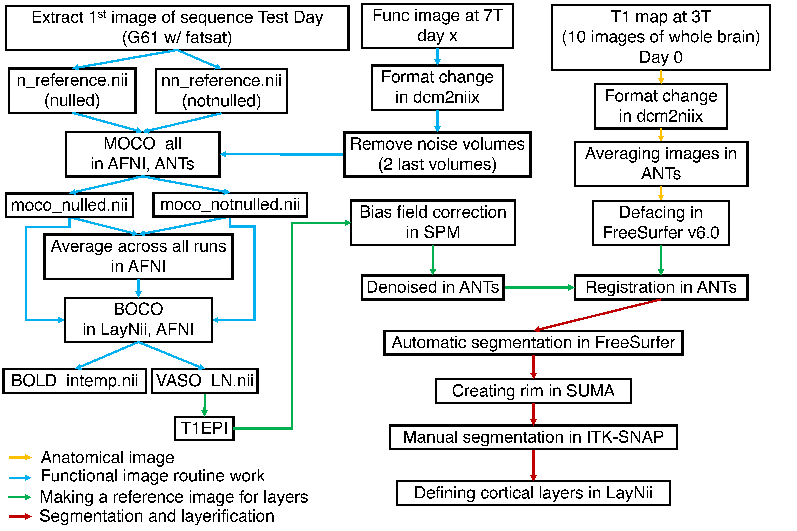

# Whole_Brain_Project

This is our repository for preprocessing on whole brain project data from DICOM to before analysis.

# Pipeline

## Tools (tested version)
- LayNii (2.2.0)
- ANTs (2.1.0)
- AFNI (AFNI_20.3.05)
- SPM (12)
- Freesurfer (7.2.0)
- ITK-SNAP (3.8.0)
- dcm2niix (v1.0.20210317)

## Anatomical image
1. format change with conv_dcm2nii.sh
2. aligning and averaging all scans with alignment.sh
3. defacing with deface_me.sh and some files (face.gca, mri_deface_osx, talairach_mixed_with_skull.gca)
(reference: https://github.com/layerfMRI/repository/tree/master/deface) 

## Functional image routine work
1. format change with conv_dcm2nii.sh
2. make reference images and motion mask by extracting the first images of G61 with fat sat in session 2 with MOCO_all.sh *need to do only once
3. motion correction with MOCO_all.sh
4. average images across run with average_across_run.sh
5. BOLD correction with BOCO.sh

## Making a reference image for layers
1. pick VASO mean image of G61 with fatsat in session 2
2. bias field correction with start_bias_field.sh, which calls: Bias_field_script_job.m
 (reference: https://github.com/layerfMRI/repository/blob/master/bias_field_corr/start_bias_field.sh 
3. denoise with denoise_me.sh 
(reference: https://github.com/layerfMRI/repository/blob/master/denoise_me.sh)
4. registration anatomical image to functional image with regist_ANAT2EPI.sh

## Segmentation and layerification
1. segmentation with freesurfer_1st.sh *note that this takes almost a day
2. check the quality with freesurfer_visualization.sh
3. manual correction on WM
4. topological correction with freesurfer_2nd.sh
5. repeat 2-4 til enough quality *we missed circus calcarine so we needed to do this 
6. create layering with AutoSeg2layering_wo_MC.sh *this already creates layering file without manual correction
7. create rim file with rim_creater.sh
8. to reduce manual correction work, we need to make rim file thinner with thinner_pial.sh
9. manual correction 
10. layerification with MC2Layering.sh 
11. downsample the layering file with down_sample_layers.sh

# Dataset
Our dataset is available on Openneuro: https://openneuro.org/datasets/ds003216
